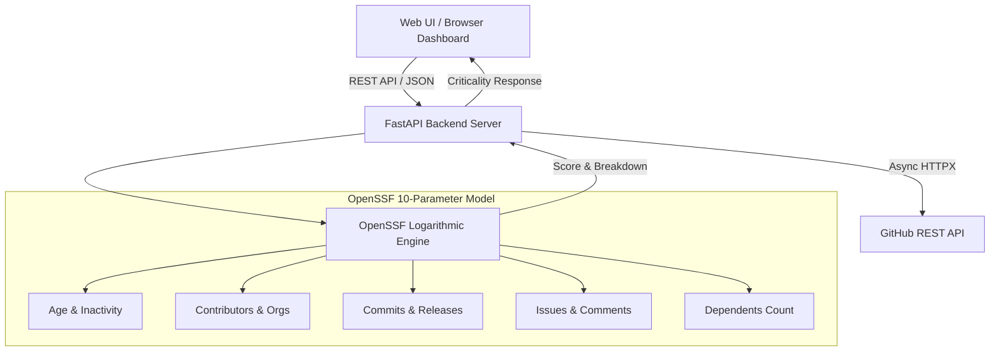

# OpenSSF Criticality Platform & Real-Time Analytics Engine 🚀

[](https://saitejabandaru-in.github.io/openssf-critical-infrastructure/)


> **🌐 Live Web Application:** **[https://saitejabandaru-in.github.io/openssf-critical-infrastructure/](https://saitejabandaru-in.github.io/openssf-critical-infrastructure/)**  
> An enterprise-grade, real-time analytics platform and reference repository designed around the official **OpenSSF Criticality Score algorithm** ($\text{Target Score} \ge 0.400$).

---

## 🌟 Overview

The **OpenSSF Criticality Platform** quantifies, visualizes, and optimizes the critical nature of open-source projects using the logarithmic metric algorithm defined by the OpenSSF Securing Critical Projects Working Group. 

It provides an end-to-end suite comprising:
1. **Real-time GitHub Live Repo Analyzer**: Analyze any public GitHub repository (e.g. `torvalds/linux`, `facebook/react`, or your own repos) and calculate live criticality scores.
2. **FastAPI Asynchronous Backend**: High-performance Python backend fetching real-time metrics with Pydantic validation.
3. **Glassmorphism Visual Analytics Dashboard**: Interactive UI featuring SVG gauges, 10-metric radar charts (Chart.js), parameter sliders, and 1-click target optimization.
4. **Automated Supply-Chain Security**: Pre-configured with 16 OpenSSF Scorecard checks, SLSA level 3 provenance, and Dependabot vulnerability patching.

---

## 📐 System Architecture



---

## 🧮 OpenSSF Criticality Score Formula

The criticality score $S$ is calculated as a weighted sum of normalized logarithmic metrics:

$$S_i = \frac{\ln(1 + \alpha_i \cdot x_i)}{\ln(1 + \alpha_i \cdot m_i)}$$

$$\text{Criticality Score} = \frac{\sum_{i=1}^{n} w_i \cdot S_i}{\sum_{i=1}^{n} w_i}$$

| Metric $x_i$ | Weight $w_i$ | Max $m_i$ | $\alpha_i$ | Direction |
| :--- | :---: | :---: | :---: | :---: |
| **Project Age (`created_since`)** | 1.0 | 120 months | 1.0 | Higher is older |
| **Inactivity (`updated_since`)** | 1.0 | 120 months | 1.0 | Inverted (Lower is better) |
| **Contributor Count (`contributor_count`)** | 2.0 | 5,000 | 0.001 | Higher is better |
| **Org Count (`org_count`)** | 1.0 | 10 | 0.1 | Higher is better |
| **Commit Frequency (`commit_frequency`)** | 1.0 | 1,000 / wk | 0.01 | Higher is better |
| **Releases (`recent_releases_count`)** | 0.5 | 26 / yr | 0.1 | Higher is better |
| **Updated Issues (`updated_issues_count`)** | 0.5 | 5,000 | 0.001 | Higher is better |
| **Closed Issues (`closed_issues_count`)** | 0.5 | 5,000 | 0.001 | Higher is better |
| **Comment Frequency (`comment_frequency`)** | 1.0 | 15 / issue | 0.1 | Higher is better |
| **Dependents Count (`dependents_count`)** | 2.0 | 500,000 | 0.00001 | Higher is better |

*A project scoring **$\ge 0.400$** is formally classified as **Critical Open Source Infrastructure**.*

---

## 🚀 Quickstart

### 1. Live Web Application
Visit **[https://saitejabandaru-in.github.io/openssf-critical-infrastructure/](https://saitejabandaru-in.github.io/openssf-critical-infrastructure/)** to use the interactive dashboard directly in your browser with zero setup required!

### 2. Launch with Docker Compose
```bash
docker-compose up -d --build
# Open http://localhost:8000 in your browser
```

### 3. Local Python Dev Server
```bash
pip install -r backend/requirements.txt
make run
# Server active at http://localhost:8000 (OpenAPI Docs at http://localhost:8000/docs)
```

---

## 🧪 Testing Suite

Run the unit tests to verify the OpenSSF logarithmic math engine and GitHub API mapping:
```bash
make test
```

---

## 🛡️ Security & OpenSSF Scorecard

This repository includes a complete supply-chain security setup:
- [`SECURITY.md`](SECURITY.md): Formal vulnerability disclosure process & response SLAs.
- [`.github/workflows/scorecard.yml`](.github/workflows/scorecard.yml): Automated OpenSSF Scorecard scanning.
- [`.github/workflows/release.yml`](.github/workflows/release.yml): SLSA Level 3 build provenance.

---

## 📜 License
Distributed under the **Apache 2.0 License**. See [`LICENSE`](LICENSE) for details.
